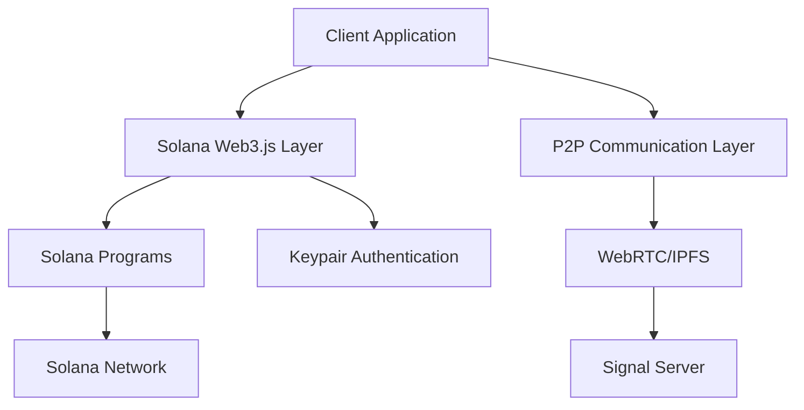

# Blockchain Messenger Architecture

## System Overview

The Blockchain Messenger is a decentralized communication platform that enables secure messaging and real-time communication through blockchain technology. The system is designed with the following core components:

### 1. Core Components

#### 1.1 Blockchain Layer
- Solana Programs
  - User Registration and Authentication (using Keypair)
  - Message Storage and Program Derived Accounts (PDAs)
  - State Management with Account Model
  - Access Control through Program Logic
- Blockchain Connection
  - RPC Connection to Solana Network
  - Transaction Management
  - Account Subscription

#### 1.2 Communication Layer
- P2P WebRTC Communication
  - Voice Calls
  - Video Calls
  - Real-time Data Channels
- IPFS for Media Storage
- Signal Server for P2P Connection Establishment

#### 1.3 Client Application
- Web3 Integration
  - Wallet Connection (MetaMask, WalletConnect)
  - Transaction Management
- User Interface
  - Chat Interface
  - Call Controls
  - Contact Management
- State Management
  - Local Storage
  - Cache Management

### 2. Technical Architecture

### 3. Data Flow

#### 3.1 Authentication Flow
1. User connects Solana wallet
2. Generate Keypair for authentication
3. Program verifies user registration using Keypair
4. Establish Connection to Solana network
5. Generate session keys for encryption
6. Establish secure communication channel

#### 3.2 Messaging Flow
1. User composes message
2. Client encrypts message with recipient's public key
3. Message is stored on blockchain (hash) and IPFS (content)
4. Recipient retrieves and decrypts message

#### 3.3 Call Flow
1. Caller initiates call request
2. Signal server facilitates P2P connection
3. WebRTC establishes direct connection
4. Real-time communication begins

### 4. Security Architecture

#### 4.1 Encryption
- End-to-end encryption for messages
- Secure key exchange through blockchain
- Perfect Forward Secrecy for calls

#### 4.2 Authentication
- Wallet-based authentication
- Challenge-response verification
- Session management

#### 4.3 Smart Contract Security
- Access control
- Rate limiting
- Reentrancy protection

### 5. Component Specifications

#### 5.1 Solana Programs
- Messenger Program: User registration, message storage
- Profile management using PDAs
- Contact list management through account structure
- Integration with Solana Program Library (SPL)

#### 5.2 P2P Communication
- WebRTC for real-time communication
- ICE/STUN/TURN servers for NAT traversal
- Signaling protocol for connection establishment

#### 5.3 Client Architecture
- Next.js for frontend
- @solana/web3.js for blockchain interaction
- React state management
- IndexedDB for local storage

### 6. Scalability Considerations

#### 6.1 On-chain Data
- Message hashes only
- Metadata optimization
- Batch processing

#### 6.2 Off-chain Storage
- IPFS for media
- P2P message delivery
- Caching strategy

### 7. Future Considerations

#### 7.1 Planned Features
- Group calls
- File sharing
- Message search
- Contact discovery

#### 7.2 Potential Improvements
- Program optimization for Solana
- Cross-program invocations
- Enhanced privacy features
- Integration with Solana Pay
- Metaplex NFT integration
